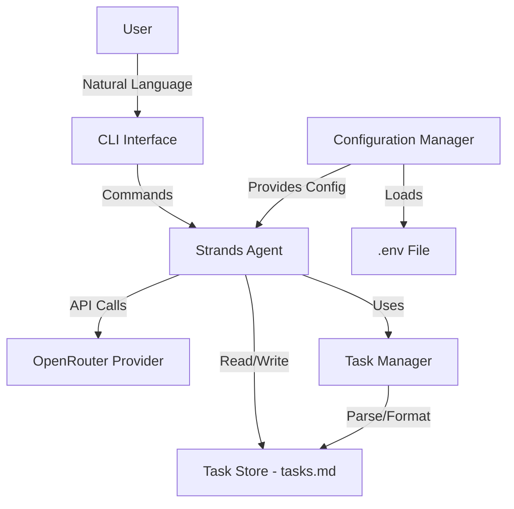

# Design Document: Task Management Assistant

## Overview

The Task Management Assistant is an AI-powered command-line application that enables users to manage tasks through natural language conversation. Built using the Strands Python library with OpenRouter as the AI provider, the system provides an intuitive interface for creating, reading, updating, and deleting tasks while maintaining a simple markdown file as the single source of truth.

### Key Design Principles

1. **Simplicity**: Single markdown file storage for transparency and portability
2. **Natural Interaction**: Conversational interface powered by AI for intuitive task management
3. **Reliability**: Pydantic-based configuration validation and robust error handling
4. **Modern Tooling**: UV package manager for fast dependency management

### System Boundaries

The system consists of:
- A Strands-based AI agent that interprets natural language commands
- A markdown file parser/writer for task persistence
- A Pydantic configuration manager for environment variable handling
- OpenRouter integration for AI capabilities

The system does NOT include:
- Web interface or GUI
- Multi-user support or authentication
- Task synchronization across devices
- Advanced scheduling or reminder features

## Architecture

### High-Level Architecture



### Component Architecture

The system follows a layered architecture:

1. **Interface Layer**: CLI that captures user input and displays responses
2. **Agent Layer**: Strands agent that orchestrates task operations using AI
3. **Business Logic Layer**: Task manager that handles CRUD operations
4. **Persistence Layer**: Markdown file reader/writer
5. **Configuration Layer**: Pydantic-based environment variable management

### Technology Stack

- **Language**: Python 3.11+
- **AI Framework**: Strands Python library
- **AI Provider**: OpenRouter (openrouter/free model)
- **Configuration**: Pydantic v2 + python-dotenv
- **Package Manager**: UV
- **Storage**: Markdown file (tasks.md)

## Components and Interfaces

### 1. Configuration Manager

**Responsibility**: Load and validate environment variables for API configuration.

**Interface**:
```python
class Settings(BaseSettings):
    """Pydantic settings model for environment configuration."""
    openrouter_api_key: str
    task_file_path: str = "tasks.md"
    default_model: str = "openrouter/free"
    
    model_config = SettingsConfigDict(
        env_file=".env",
        env_file_encoding="utf-8"
    )

def load_config() -> Settings:
    """Load and validate configuration from environment."""
    ...
```

**Key Behaviors**:
- Loads `.env` file using python-dotenv
- Validates required fields (API key must be present)
- Provides default values for optional configuration
- Raises descriptive ValidationError if configuration is invalid

### 2. Task Store

**Responsibility**: Persist and retrieve tasks from a markdown file.

**Interface**:
```python
class TaskStore:
    """Handles reading and writing tasks to markdown file."""
    
    def __init__(self, file_path: str):
        """Initialize with path to markdown file."""
        ...
    
    def read_tasks(self) -> list[Task]:
        """Parse markdown file and return list of tasks."""
        ...
    
    def write_tasks(self, tasks: list[Task]) -> None:
        """Write tasks to markdown file, replacing existing content."""
        ...
    
    def ensure_file_exists(self) -> None:
        """Create markdown file if it doesn't exist."""
        ...
```

**Markdown Format**:
```markdown
# Tasks

- [ ] Task 1 description (ID: task-001)
- [x] Task 2 description (ID: task-002)
- [ ] Task 3 description (ID: task-003)
```

**Key Behaviors**:
- Creates file if it doesn't exist
- Parses markdown checkboxes and task IDs
- Maintains valid markdown formatting
- Handles empty files gracefully

### 3. Task Manager

**Responsibility**: Implement business logic for task CRUD operations.

**Interface**:
```python
class TaskManager:
    """Manages task operations with markdown persistence."""
    
    def __init__(self, task_store: TaskStore):
        """Initialize with task store instance."""
        ...
    
    def create_task(self, description: str) -> Task:
        """Create a new task with unique ID."""
        ...
    
    def get_all_tasks(self) -> list[Task]:
        """Retrieve all tasks from storage."""
        ...
    
    def update_task(self, task_id: str, **updates) -> Task:
        """Update task attributes by ID."""
        ...
    
    def delete_task(self, task_id: str) -> bool:
        """Delete task by ID, return success status."""
        ...
    
    def find_task(self, task_id: str) -> Task | None:
        """Find task by ID."""
        ...
```

**Key Behaviors**:
- Generates unique task IDs (e.g., "task-001", "task-002")
- Validates task existence before updates/deletes
- Maintains task list consistency
- Returns appropriate success/failure indicators

### 4. Strands Agent

**Responsibility**: Orchestrate task operations through natural language interaction.

**Interface**:
```python
def create_agent(config: Settings, task_manager: TaskManager) -> Agent:
    """Create and configure Strands agent with OpenRouter."""
    ...

def run_agent(agent: Agent) -> None:
    """Run the agent's interactive loop."""
    ...
```

**Agent Tools**:
The agent will be equipped with tools for:
- `create_task(description: str)` - Create a new task
- `list_tasks()` - View all tasks
- `update_task(task_id: str, description: str = None, completed: bool = None)` - Update task
- `delete_task(task_id: str)` - Delete a task

**Key Behaviors**:
- Interprets natural language using OpenRouter
- Maps user intent to appropriate task operations
- Asks clarifying questions for ambiguous requests
- Provides natural language responses
- Handles errors gracefully with helpful messages

### 5. CLI Interface

**Responsibility**: Provide command-line entry point and user interaction.

**Interface**:
```python
def main() -> None:
    """Main entry point for the application."""
    ...
```

**Key Behaviors**:
- Initializes configuration and components
- Starts the Strands agent interactive loop
- Handles initialization errors with clear messages
- Provides clean exit on user termination

## Data Models

### Task Model

```python
from pydantic import BaseModel, Field
from datetime import datetime

class Task(BaseModel):
    """Represents a single task."""
    id: str = Field(..., description="Unique task identifier")
    description: str = Field(..., min_length=1, description="Task description")
    completed: bool = Field(default=False, description="Task completion status")
    created_at: datetime = Field(default_factory=datetime.now, description="Creation timestamp")
    
    def to_markdown(self) -> str:
        """Convert task to markdown list item."""
        checkbox = "[x]" if self.completed else "[ ]"
        return f"- {checkbox} {self.description} (ID: {self.id})"
    
    @classmethod
    def from_markdown(cls, line: str) -> "Task":
        """Parse task from markdown list item."""
        ...
```

**Validation Rules**:
- `id`: Must be non-empty string, unique within task list
- `description`: Must be non-empty string (min_length=1)
- `completed`: Boolean flag
- `created_at`: Automatically set on creation

### Configuration Model

```python
from pydantic_settings import BaseSettings, SettingsConfigDict

class Settings(BaseSettings):
    """Application configuration from environment variables."""
    openrouter_api_key: str = Field(..., description="OpenRouter API key")
    task_file_path: str = Field(default="tasks.md", description="Path to task markdown file")
    default_model: str = Field(default="openrouter/free", description="OpenRouter model to use")
    
    model_config = SettingsConfigDict(
        env_file=".env",
        env_file_encoding="utf-8",
        case_sensitive=False
    )
```

**Validation Rules**:
- `openrouter_api_key`: Required field, must be present in environment
- `task_file_path`: Optional, defaults to "tasks.md"
- `default_model`: Optional, defaults to "openrouter/free"

### Error Types

```python
class TaskNotFoundError(Exception):
    """Raised when a task ID cannot be found."""
    pass

class TaskStoreError(Exception):
    """Raised when task storage operations fail."""
    pass

class ConfigurationError(Exception):
    """Raised when configuration is invalid."""
    pass
```

